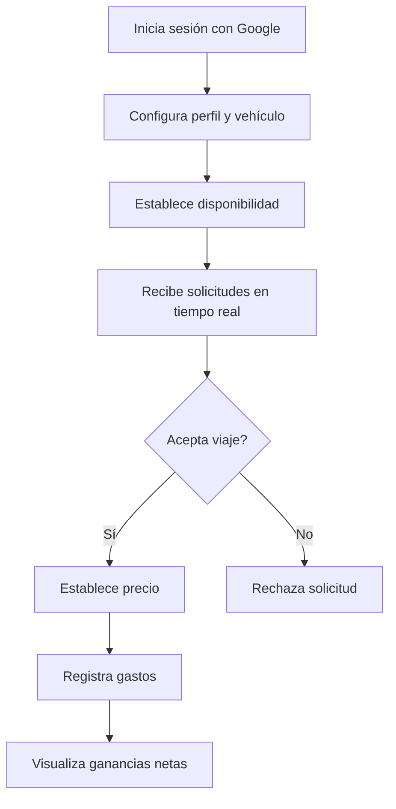
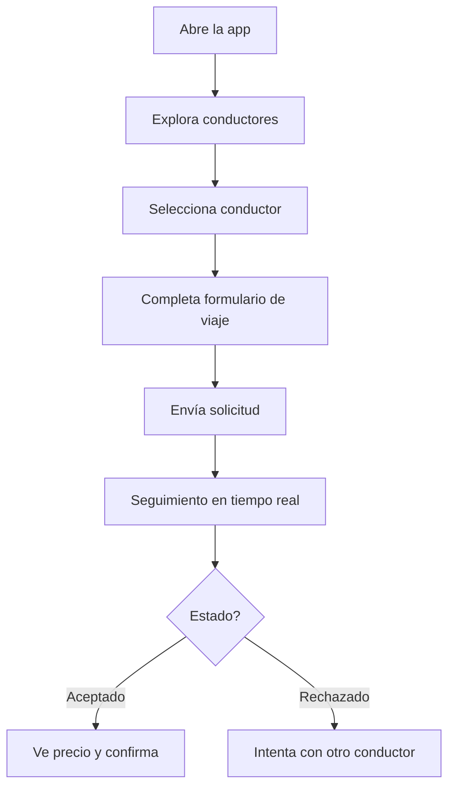

<div align="center">

# 🚖 Taxi App

<p align="center">
  
  
  
  
</p>

<p align="center">
  <strong>Aplicación completa para gestión de viajes de taxi</strong><br/>
  Conecta conductores con clientes de forma directa y eficiente
</p>

<p align="center">
  <a href="https://taxi-app-production.up.railway.app/" target="_blank">
    
  </a>
  <a href="https://taxi-app-production.up.railway.app/costumer" target="_blank">
    
  </a>
</p>

</div>

---

## 📌 Características principales

<table>
<tr>
<td width="50%" valign="top">

### 🚗 Para Conductores (Autenticados)

- ✨ **Autenticación con Google OAuth**  
  Inicio de sesión rápido y seguro
  
- 🚕 **Gestión completa de viajes**  
  Registro, aceptación y cancelación
  
- 💰 **Control de ingresos en tiempo real**  
  Seguimiento de ganancias por viaje
  
- 📉 **Registro de gastos operativos**  
  Combustible, mantenimiento, peajes
  
- 📊 **Dashboard con estadísticas**  
  Ganancias netas vs. gastos
  
- 👤 **Perfil personalizable**  
  Avatar, vehículo, disponibilidad
  
- 🔔 **Actualizaciones en tiempo real**  
  Supabase Realtime
  
- 📱 **Diseño responsive**  
  Móviles, tablets y desktop

</td>
<td width="50%" valign="top">

### 👥 Para Clientes (Sin Registro)

- 🔍 **Exploración de conductores**  
  Lista completa con información detallada
  
- 🚗 **Solicitud sin registro**  
  Sistema anónimo con ID único
  
- 📍 **Seguimiento en tiempo real**  
  Estado: pendiente/aceptado/cancelado
  
- 💵 **Precio transparente**  
  Ver costo al aprobar viaje
  
- 🌙 **Modo oscuro**  
  Interfaz adaptable
  
- 🔒 **Privacidad garantizada**  
  Sin necesidad de cuenta
  
- ⚡ **Experiencia rápida**  
  Sin complicaciones ni esperas
  
- 🎯 **Interfaz intuitiva**  
  Fácil de usar para todos

</td>
</tr>
</table>

---

<div align="center">

## 🛠️ Stack Tecnológico

</div>

<table align="center">
<tr>
<td align="center" width="96">

<br>React 18
</td>
<td align="center" width="96">

<br>TypeScript
</td>
<td align="center" width="96">

<br>Tailwind CSS
</td>
<td align="center" width="96">

<br>Supabase
</td>
<td align="center" width="96">

<br>Vite
</td>
</tr>
</table>

<div align="center">

| Tecnología | Uso |
|:----------:|:---:|
| **React 18 + Vite** | Interfaz de usuario moderna y rápida |
| **TypeScript** | Tipado estricto para mejor mantenimiento |
| **React Router DOM** | Navegación entre vistas |
| **Tailwind CSS** | Diseño responsive y modo oscuro |
| **Supabase Auth** | Google OAuth y Magic Link |
| **Supabase Database** | PostgreSQL con Row Level Security |
| **Supabase Realtime** | Actualizaciones en tiempo real (WebSockets) |
| **Lucide React** | Iconos modernos y optimizados |

</div>

---

## 📂 Estructura del proyecto

```
src/
├── components/
│   ├── Layout.tsx              # Header con navegación y dark mode
│   ├── Login.tsx               # Autenticación con Google OAuth
│   ├── TripsView.tsx           # Dashboard de viajes del conductor
│   ├── TripCard.tsx            # Card individual de viaje
│   ├── ProfileView.tsx         # Gestión de perfil y configuración
│   ├── ProfileCard.tsx         # Visualización de datos del conductor
│   ├── CostumerView.tsx        # Interfaz pública para clientes
│   ├── AddTripModal.tsx        # Modal para agregar viajes
│   ├── EarningsReport.tsx      # Reporte de ganancias
│   └── ExpenseTracker.tsx      # Seguimiento de gastos
├── supabase/
│   └── client.js               # Configuración de Supabase
├── types/
│   └── index.ts                # Definiciones de tipos TypeScript
└── main.tsx                    # Punto de entrada de la app
```


---

## 🔐 Autenticación y Seguridad

### Para Conductores
Taxi App utiliza **Supabase Auth** con las siguientes opciones:

- **Google OAuth** - Inicio de sesión con cuenta de Google (principal)
- **Magic Link (email)** - Link de acceso directo sin contraseña

Cada conductor tiene un perfil único con:
- Nombre completo (obtenido de Google)
- Avatar/foto de perfil
- Modelo y patente del vehículo
- Estado de disponibilidad (disponible/no disponible)

### Para Clientes
- **Sin registro necesario** - Sistema anónimo con customer ID único
- **Persistencia local** - ID almacenado en localStorage del navegador
- **Compatibilidad con privacidad** - Fallback para navegadores con restricciones (ej: Brave)

### Seguridad de Datos
- **Row Level Security (RLS)** - Cada conductor solo ve su información
- **Políticas de acceso** - Protección a nivel de base de datos
- **Realtime con filtros** - Actualizaciones solo de datos autorizados

---

## 🧮 Funcionalidades técnicas destacadas

### Sistema de Viajes
- **Estados de viaje**: `pending` (pendiente), `completed` (aceptado), `cancelled` (cancelado)
- **Asociación conductor-cliente**: Cada viaje vincula `owner_id` (conductor) con `customer_id` (cliente)
- **Edición de precio**: Los conductores pueden establecer el precio al aceptar un viaje

### Actualizaciones en Tiempo Real
- **Supabase Realtime** para notificaciones instantáneas:
  - Conductores reciben nuevas solicitudes sin recargar
  - Clientes ven cambios de estado automáticamente
  - Lista de conductores se actualiza al cambiar disponibilidad
- **Optimización de costos**: Realtime en lugar de polling constante

### Gestión de Datos
- **Perfiles de usuario** automáticamente creados al primer login
- **Captura de metadata de Google**: nombre completo y avatar
- **Actualización inteligente**: Perfiles existentes se completan con datos faltantes
- **Estadísticas dinámicas**: Ganancias, gastos y balance calculados en tiempo real

### Experiencia Responsive
- **Mobile-first design** con Tailwind CSS
- **Touch targets** de 44px mínimo para accesibilidad
- **Breakpoints**: móvil (320px+), tablet (640px+), desktop (1024px+)
- **Dark mode** completo en toda la aplicación

---

<div align="center">

## 🚧 Estado del Proyecto


</div>

**✅ Versión 2.0 - Completada**  
Sistema completo de conductores y clientes, autenticación OAuth, actualizaciones en tiempo real y diseño responsive.

> 🔮 Próximas mejoras y optimizaciones se implementarán en futuras versiones.

---

<div align="center">

## 🎯 Casos de Uso

</div>

<table>
<tr>
<td width="50%" valign="top">

### 🚗 Flujo del Conductor



</td>
<td width="50%" valign="top">

### 👤 Flujo del Cliente



</td>
</tr>
</table>

1. Clonar el repositorio:
```
git clone https://github.com/usuario/taxi-app.git

cd taxi-app
```

2. Instalar dependencias:
```
npm i
```

3. Crear archivo `.env` con las claves de Supabase:

```env
VITE_SUPABASE_URL=https://xxxx.supabase.co
VITE_SUPABASE_ANON_KEY=xxxxx
```

### 4️⃣ Configurar Google OAuth en Supabase

- Ir a **Authentication > Providers > Google**
- Configurar **Client ID** y **Client Secret**
- Agregar **redirect URL** autorizada

### 5️⃣ Crear las tablas en Supabase

```sql
-- Tabla de perfiles de usuario
CREATE TABLE UsersProfile (
  id SERIAL PRIMARY KEY,
  owner_id UUID REFERENCES auth.users(id) UNIQUE,
  username TEXT,
  displayName TEXT,
  email TEXT,
  phone TEXT,
  carModel TEXT,
  carPlate TEXT,
  pictureUrl TEXT,
  available BOOLEAN DEFAULT true,
  created_at TIMESTAMP DEFAULT NOW()
);

-- Tabla de viajes
CREATE TABLE Trips (
  id SERIAL PRIMARY KEY,
  owner_id UUID REFERENCES auth.users(id),
  customer_id TEXT,
  name TEXT,
  pickup TEXT,
  destination TEXT,
  passenger_phone TEXT,
  preferred_time TEXT,
  price DECIMAL,
  done TEXT CHECK (done IN ('pending', 'completed', 'cancelled')),
  created_at TIMESTAMP DEFAULT NOW()
);

-- Habilitar Row Level Security
ALTER TABLE UsersProfile ENABLE ROW LEVEL SECURITY;
ALTER TABLE Trips ENABLE ROW LEVEL SECURITY;

-- Políticas de seguridad
CREATE POLICY "Users can view their own profile" ON UsersProfile
  FOR SELECT USING (auth.uid() = owner_id);

CREATE POLICY "Users can update their own profile" ON UsersProfile
  FOR UPDATE USING (auth.uid() = owner_id);

CREATE POLICY "Users can view their own trips" ON Trips
  FOR SELECT USING (auth.uid() = owner_id);
```

### 6️⃣ Ejecutar en desarrollo

```bash
npm run dev
```

<div align="center">

**🎉 ¡Listo! La aplicación estará corriendo en `http://localhost:5173`**

</div>


---

## 🤝 Contribuciones

Las contribuciones son bienvenidas.  
Abrí un issue o PR si tenés ideas, correcciones o nuevas funcionalidades.

---

## 📄 Licencia

Este proyecto está bajo licencia MIT.  
Podés usarlo, modificarlo y distribuirlo libremente.

---

<div align="center">

## 🚀 Roadmap - Próximas Mejoras

</div>

<table>
<tr>
<td align="center" width="33%">

### 🔔 Notificaciones
- Push notifications
- Alertas en tiempo real
- Recordatorios

</td>
<td align="center" width="33%">

### 💳 Pagos
- Integración MercadoPago
- Pagos en línea
- Historial de transacciones

</td>
<td align="center" width="33%">

### 📊 Analytics
- Dashboard avanzado
- Gráficos de tendencias
- Reportes exportables

</td>
</tr>
<tr>
<td align="center">

### 🗺️ Mapas
- Google Maps
- Cálculo de rutas
- Estimación de distancias

</td>
<td align="center">

### ⭐ Calificaciones
- Sistema de rating
- Reviews de clientes
- Perfiles destacados

</td>
<td align="center">

### 📱 PWA
- App instalable
- Modo offline
- Notificaciones nativas

</td>
</tr>
</table>

---

<div align="center">

## 🤝 Contribuciones


</div>

¿Quieres colaborar? ¡Genial! Sigue estos pasos:

<table>
<tr>
<td align="center" width="20%">

### 1️⃣
**Fork**  
🍴 Haz fork del proyecto

</td>
<td align="center" width="20%">

### 2️⃣
**Branch**  
🌿 Crea tu rama  
`feature/NewFeature`

</td>
<td align="center" width="20%">

### 3️⃣
**Commit**  
💾 Guarda cambios  
`git commit -m 'Add'`

</td>
<td align="center" width="20%">

### 4️⃣
**Push**  
🚀 Sube tu rama  
`git push origin`

</td>
<td align="center" width="20%">

### 5️⃣
**PR**  
📬 Abre Pull Request

</td>
</tr>
</table>

---

## 📄 Licencia

Este proyecto está bajo licencia MIT.  
Puedes usarlo, modificarlo y distribuirlo libremente.

---

<div align="center">

## 📧 Contacto

<p align="center">
  <a href="https://github.com/SchneiderSeba" target="_blank">
    
  </a>
  <a href="https://github.com/SchneiderSeba/Taxi-App" target="_blank">
    
  </a>
</p>

**Desarrollador**: Schneider Sebastian

</div>

---

<div align="center">

### 💚 Gracias por utilizar **Taxi App**

*Hecha con dedicación para facilitar el trabajo de quienes mantienen nuestras ciudades en movimiento* 🚖

<br/>

**⭐ Si te gusta el proyecto, no olvides dejar una estrella en GitHub!**

<br/>

[](https://opensource.org/licenses/MIT)

</div>
